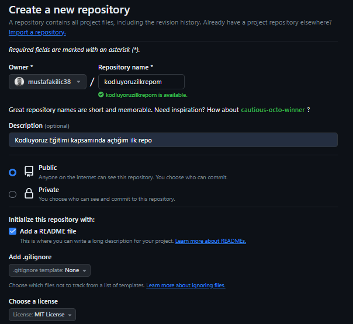

# Kodluyoruz İlk Repo
Bu repo [Kodluyoruz](https://kodluyoruz.org/) Eğitimi kapsamında açtığım ilk repo, içerisinde bir adet README dosyası,bir adet de index.html barındırıyor.


## Installation

Öncelikle projeyi clonelayın.(Buraya sizin reponuzdan aldığınız link gelecek)

```
https://github.com/mustafakilic38/kodluyoruzilkrepo.git
```
## Usage

Projeyi cloeneladıktan sonra Visual Studio Code programında açıyoruz.

Linux için:
```
cd kodluyoruzilkrepo
code
```
##Contributing
Pull requestler kabul edilir.Büyük değişiklikler için,lütfen önce neyi değiştirmek istedğinizi tartışmak için bir konu açınız.

##License
[MIT](./LICENSE)